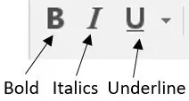

Open a new folder with vscode and create a new file inside called
`index.html`.

Insert inside the file the character `!` and choose the first option in the menu that will pop up (press enter).

The content of the file should be the following:

```html
<!DOCTYPE html>
<html lang="en">
<head>
    <meta charset="UTF-8">
    <meta name="viewport" content="width=device-width, initial-scale=1.0">
    <title>Document</title>
</head>
<body>
    
</body>
</html>
```

The following html will be inside the `body` element:

```html
<body>
    All the following examples will be inside the body element
</body>
```

# Headings

Big headings are created with the `h1` tag, smaller headings are created with `h2`, `h3`, `h4`, `h5` and `h6` tags.

```html
<h1>Avi Biter</h1>
```

The following html equivalent to the above is:

```html
<h1>
    Avi Biter
</h1>
```

Smaller headings:

```html
<h2>Shimi Tavori</h2>
<h3>Gimel Yafit</h3>
<h4>Nisim Cohen</h4>
<h5>Shlomo Levi</h5>
<h6>David Israel</h6>
```

# Paragraphs

Paragraphs are created with the `p` tag.

```html
<p>My name is Avi Biter</p>
```

The following html equivalent to the above is:

```html
<p>
    My name is Avi Biter
</p>
```

And also the following html is equivalent to the above:

```html
<p>
    My
    name
    is
    Avi
    Biter
</p>
```

# Text Format Elements



| tag         | Description      |
| :---------: | --------------   |
| `<b>`       | Bold text        |
| `<strong>`  | Important text   |
| `<i>`       | Italic text      |
| `<em>`      | Emphasized text  |
| `<mark>`    | Marked text      |
| `<small>`   | Smaller text     |
| `<del>`     | Deleted text     |
| `<ins>`     | Inserted text    |
| `<sub>`     | Subscript text   |
| `<sup>`     | Superscript text |

# Links

Links are created with the `a` tag. The `href` attribute is used to specify the link.

```html
<a href="https://blog.shaharbest.com">Shahar's Blog</a>
```

The following html equivalent to the above is:

```html
<a href="https://blog.shaharbest.com">
    Shahar's Blog
</a>
```

# Images

Images are created with the `img` tag. The `src` attribute is used to specify the image.

```html

```

The `alt` attribute is used to specify the text that will be displayed if the image is not loaded.

# Lists

## Unordered

```html
<ul>
  <li>Coffee</li>
  <li>Tea</li>
  <li>Milk</li>
</ul>
```

## Ordered

```html
<ol>
  <li>Coffee</li>
  <li>Tea</li>
  <li>Milk</li>
</ol>
```

# Iframes






