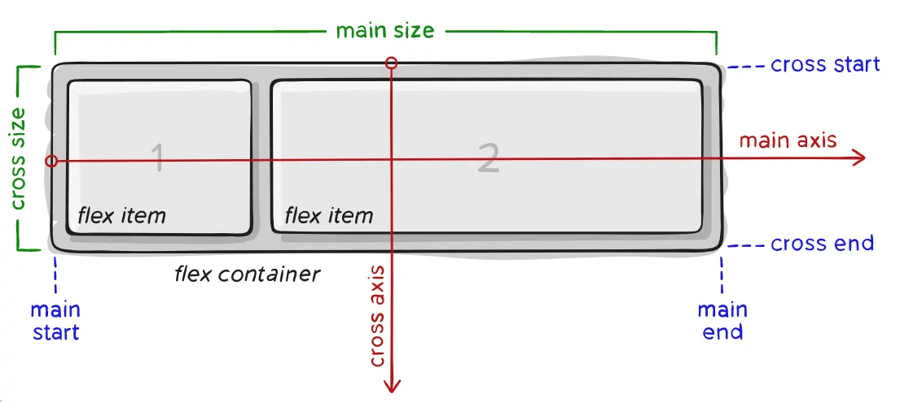
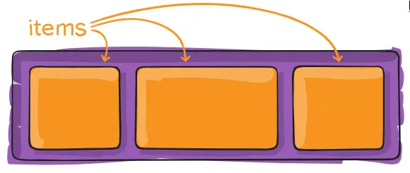
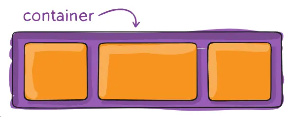
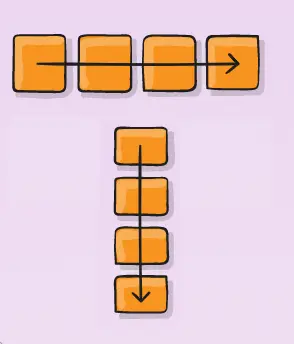
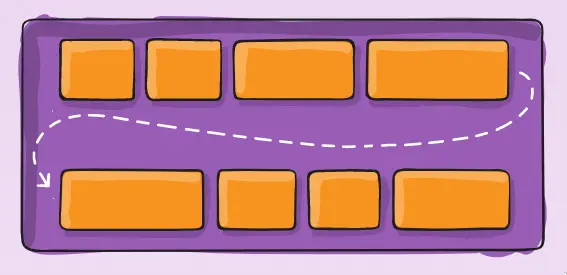
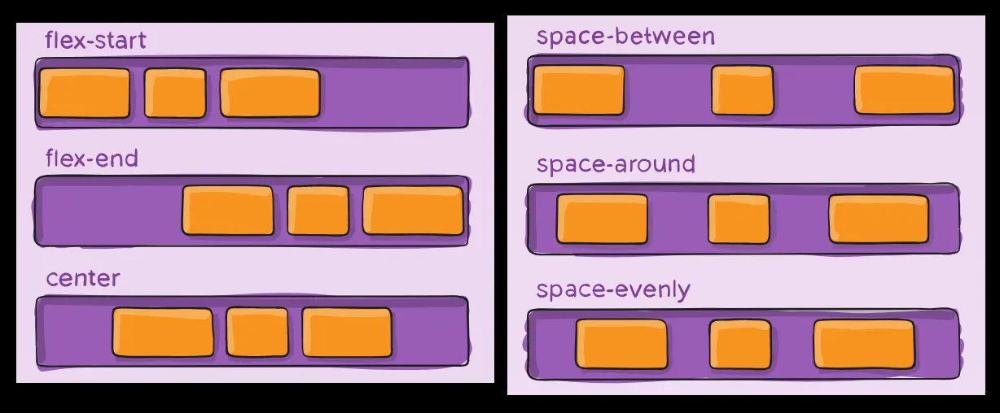
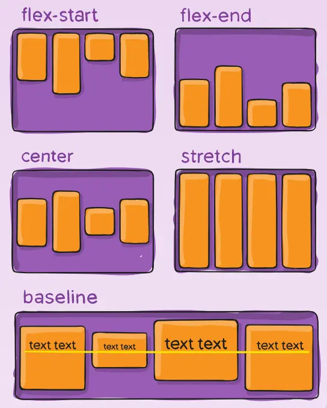
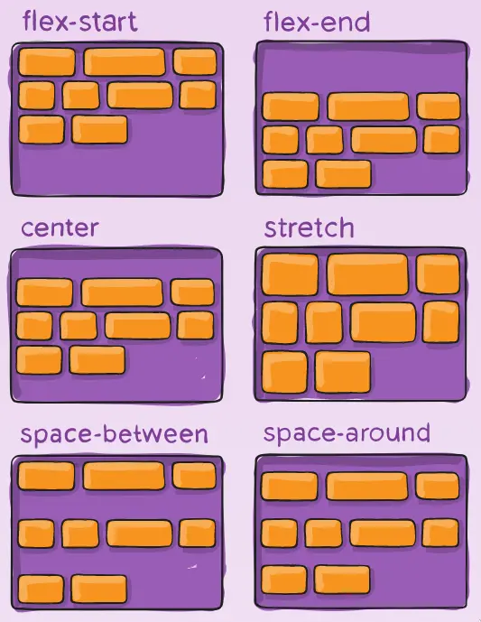
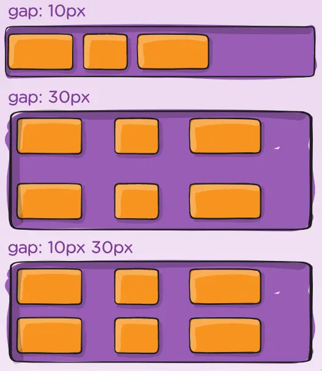

Full and comprehensive guide where I brought the images from:
[link](https://css-tricks.com/snippets/css/a-guide-to-flexbox/).

## Terms



## Items and Container





## Structure

```html
<div class="container">
	<div class="item">nisim</div>
	<div class="item">shlomo</div>
	<div class="item">david</div>
</div>
```

```css
.container {
	display: flex;
}
```

## `flex-direction`

```css
.container {
	display: flex;
	flex-direction: row | column;
}
```



## `flex-wrap`

```css
.container {
	display: flex;
	flex-wrap: wrap;
}
```



## `justify-content`

What does "justify" mean?


Justify
: The alignment of text to the left/right/both margins.

```css
.container {
	display: flex;
	justify-content: flex-start;
}
```



## `align-items`

```css
.container {
	display: flex;
	align-items: stretch;
}
```



## `align-content`

```css
.container {
	display: flex;
	align-content: flex-start;
}
```



## `gap`

```css
.container {
	display: flex;
	gap: 1rem;
}
```

Different gap between cols and rows:

```css
.container {
	display: flex;
	gap: 10px 20px;
}
```



