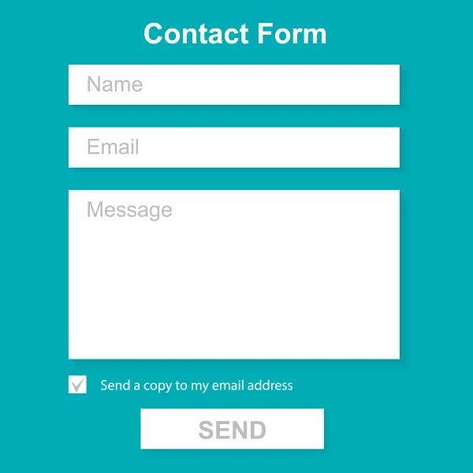
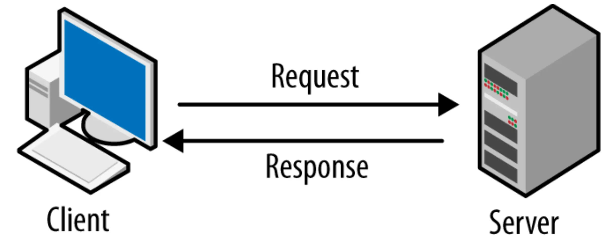
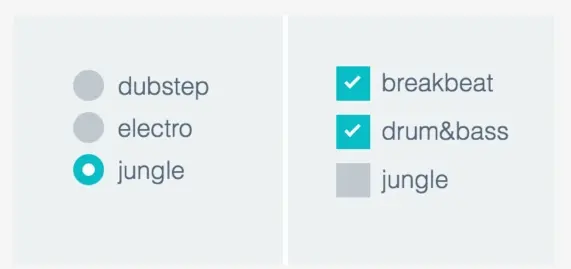

Form Structure:

```html
<form action="/action_page.php" method="get">
	<!-- your inner form elements -->
</form>
```

Example:

```html
<form>
	<label for="fname">First name:</label>
	<input type="text" id="fname" name="fname">
	<label for="lname">Last name:</label>
	<input type="text" id="lname" name="lname">
</form>
```

Input Element:

```html
<input type="text" id="fname" name="fname">
```

Label Element:

```html
<label for="fname">First name:</label>
<input type="text" id="fname" name="fname">
```

The `name` attribute is for the server side.



The `for` attribute is for mapping the label to the input element.

Dropdown list:

```html
<select id="cars" name="cars">
  <option value="volvo">Volvo</option>
  <option value="saab">Saab</option>
  <option value="fiat">Fiat</option>
  <option value="audi">Audi</option>
</select>
```

Default Option:

```html
<option value="fiat" selected>Fiat</option>
```



A Boolean Option:
[spec](https://html.spec.whatwg.org/multipage/common-microsyntaxes.html#boolean-attributes)

Text Area:

```html
<textarea rows="10" cols="30"></textarea>
```

## Radio Button and Checkbox



Radio Button:

```html
<input type="radio" id="bamba-radio" name="fav_food" value="bamba">
<label for="bamba-radio">Bamba</label>

<input type="radio" id="bisli-radio" name="fav_food" value="bisli">
<label for="bisli-radio">Bisli</label>

<input type="radio" id="humus-radio" name="fav_food" value="humus">
<label for="humus-radio">Humus</label>
```

Checkbox:

```html
<input type="checkbox" id="vehicle1" name="vehicle1" value="Bike">

<input type="checkbox" id="vehicle2" name="vehicle2" value="Car">

<input type="checkbox" id="vehicle3" name="vehicle3" value="Boat">
```

Submit Button:


```html
<button type="submit">kishke</button>
```

or

```html
<input type="submit" value="kishke">
```

Reset button:


```html
<button type="reset">bamba</button>
```

Input Types:

```html
<input type="?">
```

placeholder:



`input` element attributes summary:

* `id`
* `name`
* `type`
* `for`
* `value`
* `placeholder`

Other Elements:

* `fieldset`
* `legend`
* `datalist`
* `optgroup`

Other `input` types values:

* `color`
* `date`
* `email`
* `file   `
* `hidden`
* `image`
* `month`
* `number `
* `password`
* `range`
* `search`
* `tel    `
* `time`
* `url`
* `week           `

# Form Validation

no validation:

```html
<form>
	<intput type="text" name="userName">
	<button>submit</button>
</form>
```

`required` attribute:

```html
<intput type="text" name="userName" required>
```

`minlength` attribute:

```html
<intput type="text" name="userName" minlength="8">
```

`maxlength` attribute:

```html
<intput type="text" name="userName" maxlength="20">
```

`pattern` attribute:

```html
<intput type="text" name="userName"
	pattern="^[a-z]* [a-z*]$">
```

`number` type:

```html
<intput type="number" name="amount">
<intput type="number" name="amount"
	min="5">
<intput type="number" name="amount"
	max="10">
<intput type="number" name="amount"
	min="5" max="10">
```
