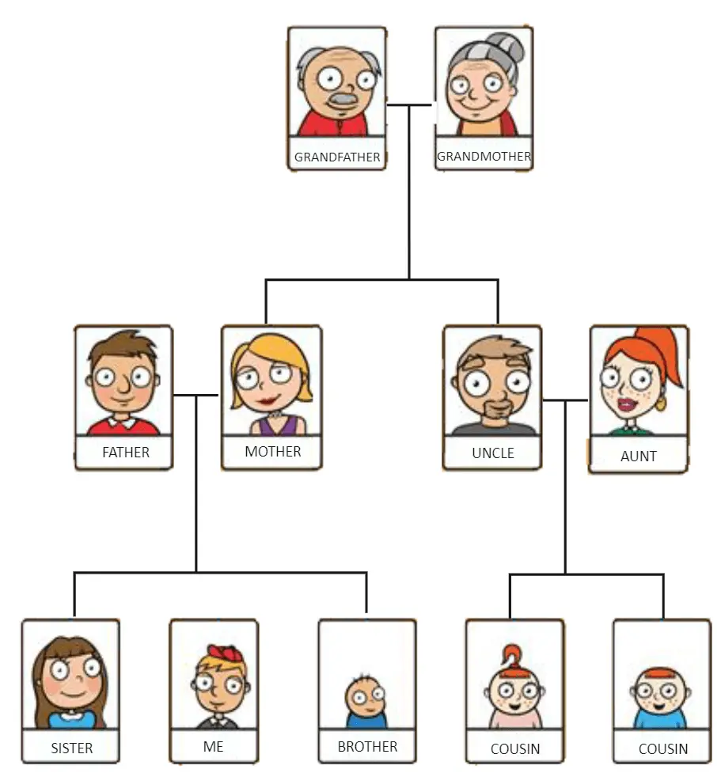

## Syntax

```css
selector {
	property1: value1;
	property2: value2;
}
```

The new lines are ignored so it's equivalent to the following:

```css
selector {
	property1: value1; property2: value2;
}
```

```css
selector { property1: value1; property2: value2; }
```

When it's just a single definition I like to write it in a single line:

```css
selector { property: value; }
```

## Example

```css
h1 {
	color: blue;
}
```

## Most Common Selectors

- Element
- Class
- ID

## ID

The `id` attribute should be unique among the rest of the element in the same
webpage.

```html
<h1 id="shimon">
	whatever
</h1>
```

## Using ID Selector

Syntax:

```css
#id-name {
	property: value;
}
```

Example:

```css
#shimon {
	color: green;
}
```

## Class

```html
<h1 class="bamba">
	whatever
</h1>
```

## Using Class Selector

Syntax:

```css
.class-name {
	property: value;
}
```

Example:

```css
.shimon {
	color: green;
}
```

## Grouping Selector

Without group selector:

```css
h1 {
	color: blue;
}

h2 {
	color: blue;
}
```

With group selector:

```css
h1, h2 {
	color: blue;
}
```

## Multiple Class

```html
<h1 class="shimon nissim doron">
	pompa
</h1>
```

Pay attention to the space delimiter!

## Using Class Selector

Syntax:

```css
.class-name {
	property: value;
}
```

Example:

```css
.bamba {
	color: yellow;
}
```

## Selectors can combine!


## Examples

**No space** between the two selectors:

```css
.class-1.class-2 {
	property: value;
}

div.class-1 {
	property: value;
}

div.class-1.class-2 {
	property: value;
}

#shimon.class-1 {
	property: value;
}

#shimon.class-1.class-2 {
	property: value;
}

div#shimon.class-1.class-2 {
	property: value;
}
```

## Descendants Combinator

**Pay attention to the space!**

```css
.ancestor .descendant {
	properties: value;
}
```



## Child Combinator

```css
.parent > .child {
	properties: value;
}
```


Descendant $\neq$ Child

## Combine The Previous Ones

```css
header.shimon h1.david {
	color: blue;
}
```

## Universal Selector

```css
* {
	font-family: Ariel;
}
```


So far we should understand the meaning of the following selectors:

```css
div {}
#nisim {}
.shlomo {}
.class1.class2 {}
nav li {}
nav > li {}
* {}
```

## Psaudo Class

A selector that is used to define a special state of an element.

Syntax:

```css
selector:pseudo-class {
	property: value;
}
```

## Hover

```css
li:hover {
	background-color: red;
}
```

Hover combined with a class selector:

```css
li.nisim:hover {
	background-color: red;
}
```

More combinations:

```css
p {
	display: none;
}

div:hover p {
	display: block;
}
```

## `:first-child`

```css
p:first-child {
	background-color: red;
}
```

## `:focus`

```css
input:focus {
	background-color: red;
}
```

## `:nth-child(pattern)`

```css
li:nth-child(3) { background-color: red; }
li:nth-child(odd) { background-color: red; }
li:nth-child(even) { background-color: red; }
li:nth-child(3n) { background-color: red; }
li:nth-child(3n + 1) { background-color: red; }
```

## Anchor States

```css
a:link { color: red; }
a:visited { color: blue; }
a:hover { color: green; }
a:active { color: yellow; }
```

## Inputs States

```css
input:checked { background-color: green; }
input:disabled { background-color: red; }
input:valid { background-color: green; }
input:invalid { background-color: red; }
input:required { background-color: red; }
input:optional { background-color: green; }
```
