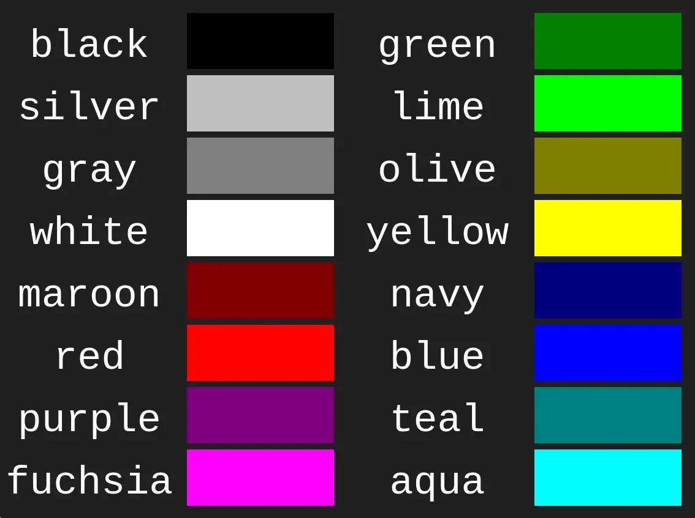

# Inserting CSS

There are three ways of inserting a style sheet:

- External
- Internal
- Inline

## Inline

```html
<h1 style="color: blue;">A Blue Heading</h1>
```

## Internal

```html
<!DOCTYPE html>
<html>
	<head>
		<style>
			body {
                background-color: green;
            }

			h1 {
                color: blue;
            }

			p {
                color: red;
            }
		</style>
	</head>
	<body>
		<h1>This is a heading</h1>
		<p>This is a paragraph.</p>
	</body>
</html>
```

## External

`index.html`

```html
<!DOCTYPE html>
<html>
	<head>
		<link rel="stylesheet" href="styles.css">
	</head>
	<body>
		<h1>This is a heading</h1>
		<p>This is a paragraph.</p>
	</body>
</html>
```

`style.css`

```css
body { background-color: powderblue; }
h1 { color: blue; }
p { color: red; }
```

# Structure

```html
<tagname style="property: value;">
<tagname style="property1: value1; property2: value2;">
```

# Examples

```html
<p style="color: red;">This is a red paragraph.</p>
<body style="background-color: black;"></body>
<h1 style="font-family: verdana;">This is a heading</h1>
<h1 style="font-size: 300%;">This is a heading</h1>
<h1 style="text-align: center;">Centered Heading</h1>
```

# Properties

- `color`
- `background-color`
- `font-family`
- `font-size`
- `text-align`

# Values Types

## Colors

### Standard Color Names



### rgb Code

```css
p { color: rgb(255, 0, 0); }
body { background-color: rgb(0, 0, 255); }
h1 { color: rgb(0, 255, 0); }
h2 { color: rgb(255, 255, 0); }
```

### hex Code

```css
p { color: #ff0000; }
body { background-color: #0000ff; }
h1 { color: #00ff00; }
h2 { color: #ffff00; }
```

### hsl Code

```css
p { color: hsl(0, 100%, 50%); }
body { background-color: hsl(240, 100%, 50%); }
h1 { color: hsl(120, 100%, 50%); }
h2 { color: hsl(60, 100%, 50%); }
```
