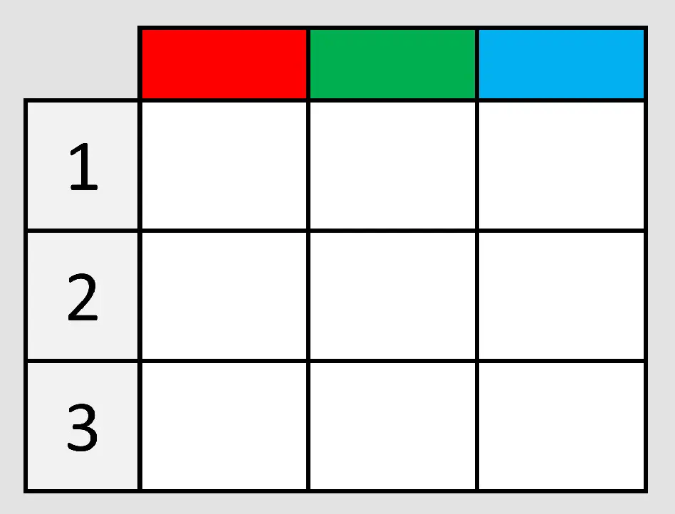
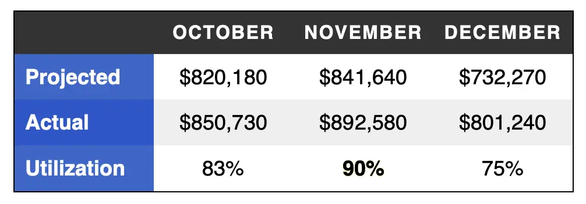
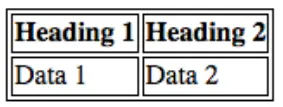
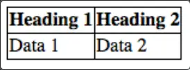
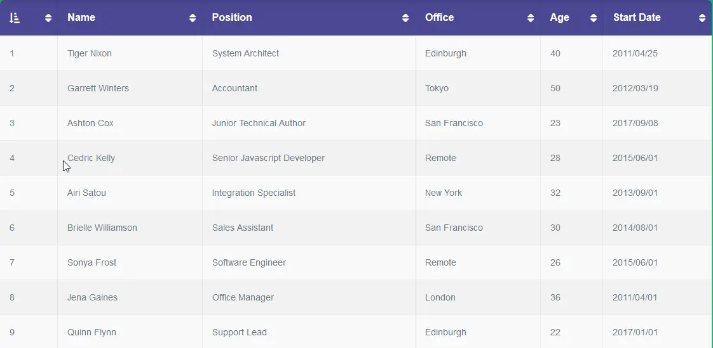
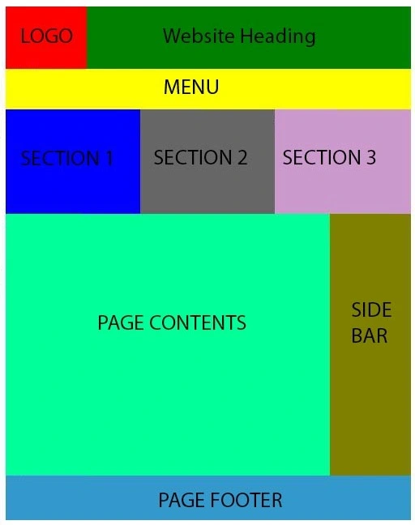

How To Code This?

| A | B |
|---|---|
| C | D |

```html
<table>
	<tr>
		<td>A</td>
		<td>B</td>
	</tr>
	<tr>
		<td>C</td>
		<td>D</td>
	</tr>
</table>
```

Reminder: The browser don't care about the spaces and the new lines so the following is equivalnet to the above:

```html
<table>
	<tr><td>A</td><td>B</td></tr>
	<tr><td>C</td><td>D</td></tr>
</table>
```

# Table Headers



# How

|   | D  | C
|---|----|----
| M | 42 | 10
| F | 9  | 39

# Code

```html
<table>
	<tr>
		<th></th>
		<th>D</th>
		<th>C</th>
	</tr>
	<tr>
		<th>M</th>
		<td>42</td>
		<td>10</td>
	</tr>
	<tr>
		<th>F</th>
		<td>9</td>
		<td>39</td>
	</tr>
</table>
```

# Merge Cells

```html
<td colspan="2">nisim</td>

<td rowspan="3">nisim</td>
```

# Border



# Fix


```css
table { border-collapse: collapse; }
```



# Cols

```html
<table>
  <tr>
    <th>Data 1</th>
    <th style="background-color: yellow">Data 2</th>
  </tr>
  <tr>
    <td>Calcutta</td>
    <td style="background-color: yellow">Orange</td>
  </tr>
  <tr>
    <td>Robots</td>
    <td style="background-color: yellow">Jazz</td>
  </tr>
</table>
```

# `colgroup`

```html
<table>
  <colgroup>
    <col />
    <col style="background-color: yellow" />
  </colgroup>
  <tr>
    <th>Data 1</th><th>Data 2</th>
  </tr>
  <tr>
    <td>Calcutta</td><td>Orange</td>
  </tr>
  <tr>
    <td>Robots</td><td>Jazz</td>
  </tr>
</table>
```

# Apply the same

```html
<colgroup>
  <col style="background-color: yellow" span="2" />
</colgroup>
```

# Wrappers

* `thead`
* `tbody`
* `tfoot`

tables meant to display tabular data.



not for page layout



The reason why is it's not good for page layout is because it's harder to make
it:

1. responsive.
2. accessible.
3. cause tag soup.
