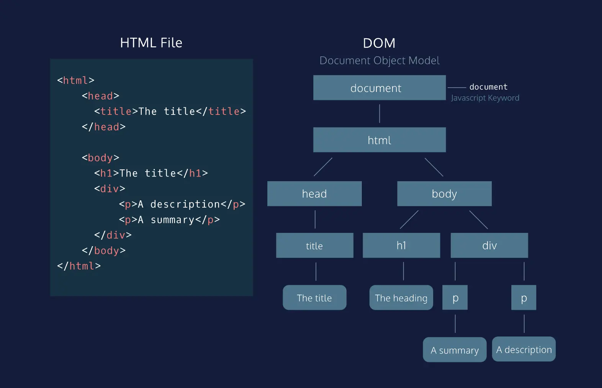

meet the `document` object

```javascript
console.log(document);
```

This object holds the representation



## Access

* *querySelector* - return the first element
* *querySelectorAll* - return all elements (array)

```javascript
const e1 = document.querySelector('h1');
const e2 = document.querySelector('#nisim');
const e3 = document.querySelector('.singers');
```

```javascript
const elArray = document.querySelectorAll('h1');
const singersElArray = document.querySelectorAll('.singers');
```

alternative to the use of selectors:
*getElementsByClassName*,
*getElementById* and
*getElementsByTagName*.

Equivalence:

```javascript
const el = document.getElementById('nisim');
const el = document.querySelector('#nisim');
```

```javascript
const el = document.getElementsByClassName('singers');
const el = document.querySelectorAll('.singers');
```

```javascript
const el = document.getElementsByTagName('h1');
const el = document.querySelectorAll('h1');
```

## Edit

### Set text inside an element

*index.html*

```html
<h1 id="shlomo-heading">shlomo title</h1>
```

set element inner text with the `innerText` property

*script.js*

```javascript
const shlomoHeading = document.querySelector('#shlomo-heading');

shlomoHeading.innerText = 'avi biter';
```

after the script will run the dom will be as follow:

`index.html`

```html
<h1 id="shlomo-heading">avi biter</h1>
```

### Set element class

`index.html`

```html
<h2 id="nisim-heading" class="wojaks">
	nisim title
</h2>
```

edit element classes with the methods
*add* and *remove*
of the property *classList*

```javascript
const nisim = document.querySelector('#nisim-heading');

// adds the class 'chads'
nisim.classList.add('chads');

// remove the class 'wojaks'
nisim.classList.remove('wojaks');
```

```html
<h2 id="nisim-heading" class="chads">
	nisim title
</h2>
```

## Edit Style

edit style with the `style` property

```javascript
const nisimEl = document.querySelector('#nisim-heading');
nisimEl.style.backgroundColor = 'red';
```

## Add Elements

```javascript
const avi = document.createElement('h1');
avi.innerText = 'avi biter';
avi.classList.add('chads');

const mainEl = document.querySelector('main');
mainEl.append(avi);
```

## Inject HTML code

using the property `innerHTML`

```javascript
const mainEl = document.querySelector('main');
mainEl.innerHTML = ``;
```

## Remove Element

using the method `remove`

```javascript
const nisimInput = document.querySelector('nisim-input');
nisimInput.remove();
```
