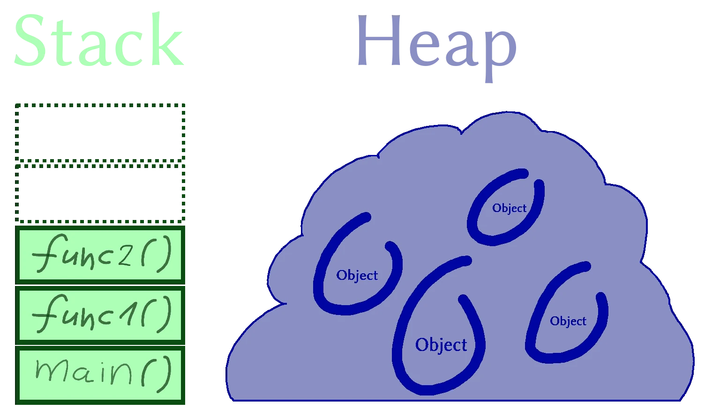

## Object Variable Holds Address

```js
const nisim = { david: 42 };
const shlomo = nisim;

// nisim: { david: 42 }
// shlomo: { david: 42 }

nisim.david = 666;

// nisim: { david: 666 }
// shlomo: { david: 666 }
```

## Function Argument Examples

### Primitives

```js
let nisim = 42;

function doSomething(shlomo) {
    // shlomo: 42
    shlomo = 666;
    // shlomo: 666
}

// nisim: 42
doSomething(nisim);
// nisim: 42
```

### Property Assignment

```js
const nisim = { david: 42 };

// nisim: { david: 42 }
doSomething(nisim);
// nisim: { david: 666 }

function doSomething(shlomo) {
    // shlomo: { david: 42 }
    shlomo.david = 666;
    // shlomo: { david: 666 }
}
```

### Argument Assignment

```js
const nisim = { david: 42 };

// nisim: { david: 42 }
doSomething(nisim);
// nisim: { david: 42 }

function doSomething(shlomo) {
    // shlomo: { david: 42 }
    shlomo = { david: 666 };
    // shlomo: { david: 666 }
}
```

## Comparison

```js
const nisim = { david: 42 };
const shlomo = { david: 42 };

console.log(nisim === shlomo); // false
```

```js
const nisim = { david: 42 };
const shlomo = nisim;

console.log(nisim === shlomo); // true
```
