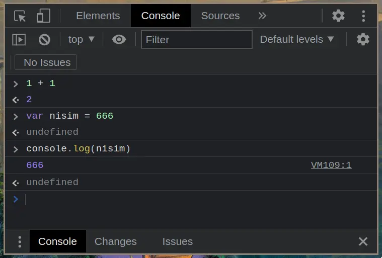

# Quick Start

## Examples For Output Commands

A command to show a message in a popup window:

```js {path="partials/head.html"}
window.alert('Avi Biter');
```

A command to show a message in the console:

```js
console.log('Avi Biter');
```

## Where to Write JS Code?

### REPL

Open devtools in your browser, open the console tab.
Write your code in the console and press enter.



### In The HTML file

Run your code every time the page is loaded:

We use the `script` tag to write JS code in HTML.

```html
<script>
  console.log('Avi Biter');
</script>
```

It can be written in the `head` or in the `body` of the HTML.

```html
<!DOCTYPE html>
<html>
  <head>
    <!-- head option -->
    <script>
      console.log('Avi Biter');
    </script>
  </head>

  <body>
    <!-- body option -->
    <script>
      console.log('Avi Biter');
    </script>
  </body>
</html>
```

### External File

Create a file with the extension `.js` and write your code in it.

`pita.js`

```js
console.log('Avi Biter');
```

In the HTML file, add the `script` tag with the `src` attribute:

```html
<!DOCTYPE html>
<html>
  <head>
    <!-- head option -->
    <script src="pita.js"></script>
  </head>

  <body>
    <!-- body option -->
    <script src="pita.js"></script>
  </body>
</html>
```

My preference:

```html
<!DOCTYPE html>
<html>
  <head>
    <script src="pita.js" defer></script>
  </head>

  <body></body>
</html>
```

## Reacting To A Click Of A Button


### Inline

```html
<button onclick="console.log('Avi Biter')">
  Click Me
</button>
```

### In The HTML File

`index.html`

```html
<!DOCTYPE html>
<html>
  <head>
    <script src="pita.js" defer></script>
  </head>

  <body>
    <button onclick="logAviBiter()">Click Me</button>
  </body>
</html>
```

`pita.js`

```js
function logAviBiter() {
  console.log('Avi Biter');
}
```

When it's a function we can write multiple lines of code:

```js
function logAviBiter() {
  console.log('Avi Biter');
  console.log('Avi Biter');
  console.log('Avi Biter');
}
```

# Data

## Variables

### Declaration And Assignment

```js
let nisim; // Declaration
nisim = 42; // Assignment
```

shorhand:

```js
let nisim = 42;
```

### `const` vs `let`:

variable declared with `let` **can** be reassigned.

```js
let nisim = 42;
nisim = 43; // OK
```

variable declared with `const` **can't** be reassigned.

```js
const nisim = 42;
nisim = 43; // Error
```


## Concatenation
