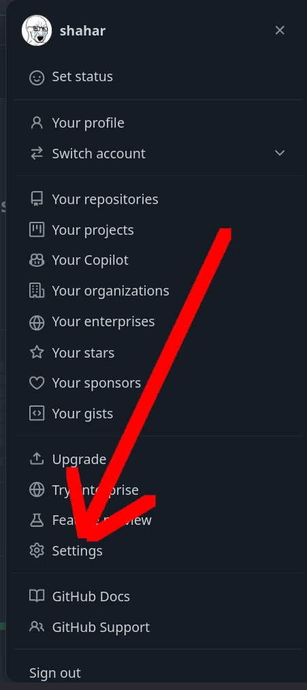
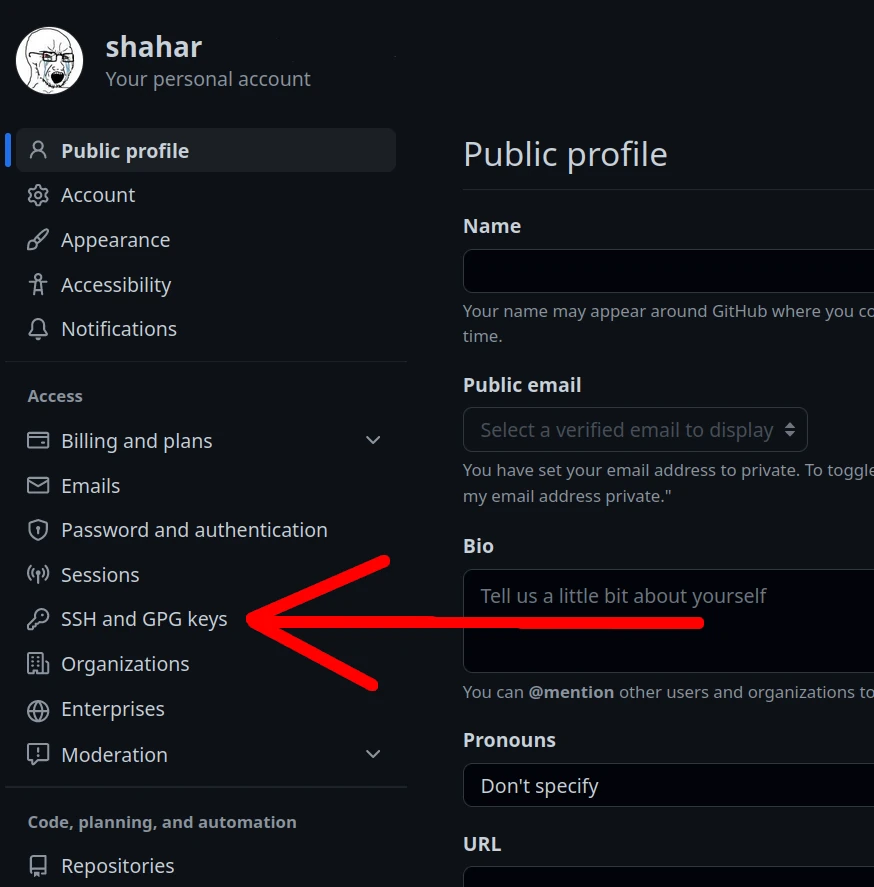
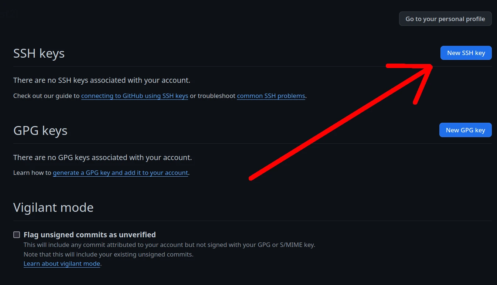
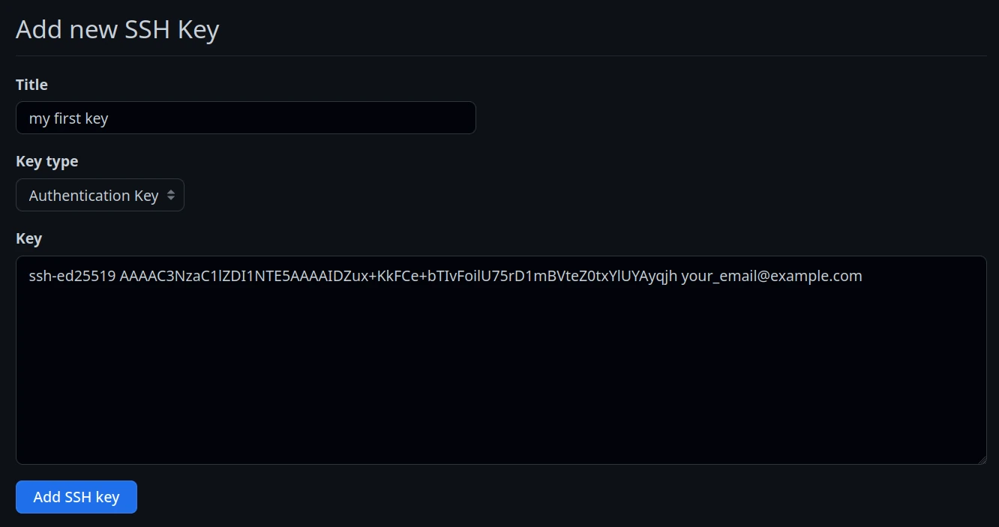

Create your keys

```sh
ssh-keygen -t ed25519 -C "your_email@example.com"
```

Change working directory to *~/.ssh*

```
cd ~/.ssh
```

Two text files should be there:

|    File Name     |   Meaning   |
|:----------------:|:-----------:|
|   *id_ed25519*   | private key |
| *id_ed25519.pub* | public key  |

The name could be something else but both should
be the same except for the *.pub* extension.

You can output the content of your public key with the `cat` command:

```
cat ~/id_ed25519.pub
```

Go to `settings` in your github account



Click on `SSH and GPG keys`



Click on `New SSH key`



* Insert whatever title
* Insert your public key in the big input box
* Click `Add SSH key`


