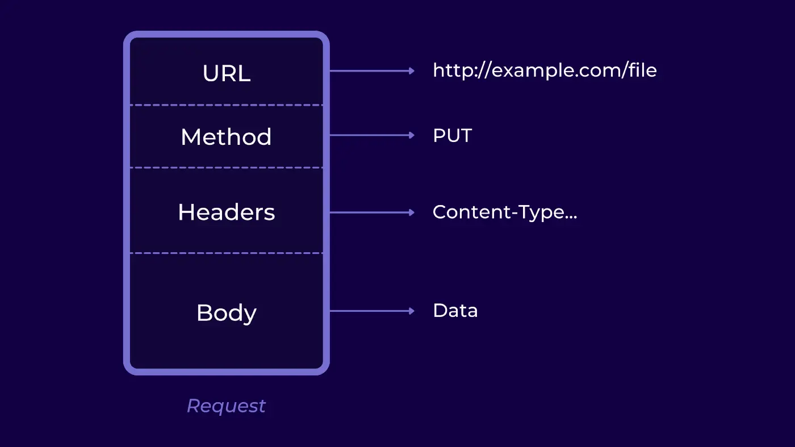
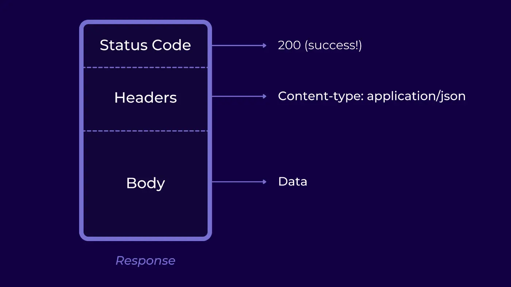

# Theory

## Request Structure



### Example

```txt
POST israel-train.com/station

Accept: application/json
Authorization: sdfjshdfjh83748374
Connection: keep-alive

{
	nisim: 42
}
```

---

## Response Structure



### Example

```txt
200 OK

Transfer-Encoding: chunked
Content-Encoding: deflate
Connection: keep-alive

{
	"id": 123,
	"city": "Ashkelon"
}
```

---

## STATUS CODE

|   Code    |     Meaning      |
|:---------:|:----------------:|
| 200 – 299 |       GOOD       |
| 400 – 499 | CLIENT MESSED UP |
| 500 – 599 |   SERVER FAULT   |

---

## Methods

* `GET`
* `POST`
* `DELETE`
* `PATCH`
* `PUT`

---

## Headers

* Content-Type

---

# Demo

On our local host runs REST API server.
One of it's entities is "users".
In this demo we will review
the execution of the following set of HTTP requests:

| Method    | Route     | Body                                              |
| :-------: | :-------: | :-------:                                         |
| GET       | /users    |                                                   |
| GET       | /users/1  |                                                   |
| GET       | /users/2  |                                                   |
| POST      | /users    | { "name": "avi biter", "email": "avi@gmail.com" } |
| GET       | /users    |                                                   |
| DELETE    | /users/2  |                                                   |
| GET       | /users    |                                                   |
| PATCH     | /users/4  | { "email": "avi@walla.com" }                      |
| GET       | /users    |                                                   |

We will review the "curl" command that can execute each request.
Those HTTP request can also be executed by different software.
We will also review the response of each request.

---

## GET - /users

```sh
curl "localhost:3000/users"
```

### Response

status code: `200`

body:

```json
[
  { "id": 1, "name": "nisim", "email": "nisim@gmail.com" },
  { "id": 2, "name": "shlomo", "email": "shlomo@gmail.com" },
  { "id": 3, "name": "david", "email": "david@gmail.com" }
]
```

---

## GET - /users/1

```sh
curl "localhost:3000/users/1"
```

### Response

status code: `200`

body:

```json
{ "id": 1, "name": "nisim", "email": "nisim@gmail.com" }
```

---

## GET - /users/2

```sh
curl "localhost:3000/users/2"
```

### Response

status code: `200`

body:

```json
{ "id": 2, "name": "shlomo", "email": "shlomo@gmail.com" }
```

---

## POST - /users

```sh
curl -X POST -H "Content-Type: application/json" -d '{
    "name": "avi biter",
    "email": "avi@gmail.com"
}' http://localhost:3000/users
```

### Response

status code: `201`

---

## GET - /users

```sh
curl "localhost:3000/users"
```

### Response

status code: `200`

body:

```json
[
  { "id": 1, "name": "nisim", "email": "nisim@gmail.com" },
  { "id": 2, "name": "shlomo", "email": "shlomo@gmail.com" },
  { "id": 3, "name": "david", "email": "david@gmail.com" },
  { "id": 4, "name": "avi biter", "email": "avi@gmail.com" }
]
```

---

## DELETE - /users/2

```sh
curl -X DELETE http://localhost:3000/users/2
```

### Response

status code: `200`

---

## GET - /users

```sh
curl "localhost:3000/users"
```

### Response

status code: `200`

body:

```json
[
  { "id": 1, "name": "nisim", "email": "nisim@gmail.com" },
  { "id": 3, "name": "david", "email": "david@gmail.com" },
  { "id": 4, "name": "avi biter", "email": "avi@gmail.com" }
]
```

---

## PATCH - /users/4

```sh
curl -X PATCH -H "Content-Type: application/json" -d '{
    "email": "avi@walla.com"
}' http://localhost:3000/users/4
```

### Response

status code: `200`

---

## GET - /users

### Response

status code: `200`

body:

```json
[
  { "id": 1, "name": "nisim", "email": "nisim@gmail.com" },
  { "id": 3, "name": "david", "email": "david@gmail.com" },
  { "id": 4, "name": "avi biter", "email": "avi@walla.com" }
]
```
