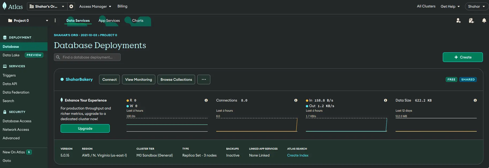
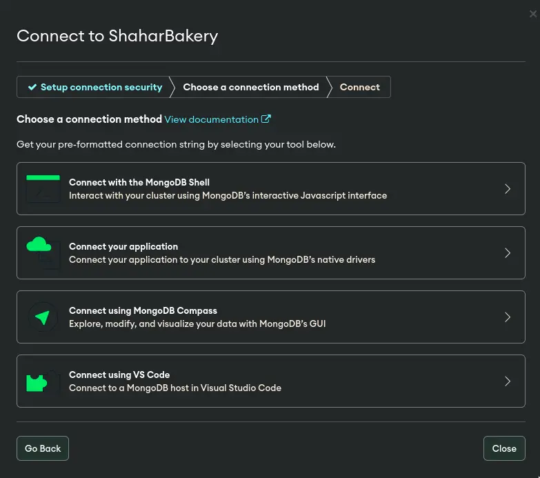
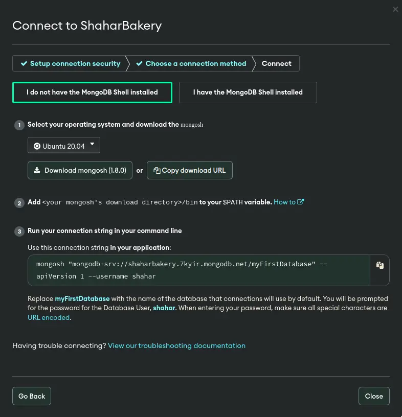

Atlas Dashboard



Connect Dialog





after a successful connection establishment
you will face a session with a prompt
like the following:

```txt
Atlas atlas-sefmue-shard-0 [primary] test>
```

---------------------------------

# Basic Sampling

list databases

```javascript
show dbs
```

use a database

```txt
use my-db
```

if the *shahar-db* doesn't exist
then it will be created after you add data in it

list collections

```javascript
show collections
```

to drop the used db run (require user permissions):

```javascript
db.dropDatabase()
```

---------------------------------------

# Inserting Documents

```javascript
use pita
db.users.insertOne({ name: "nisim" })
```

after running it a *pita* db will be created with a *users* collection with the document: *{ name: "nisim" }*

Print All Rows

```javascript
use pita
db.users.insertOne({ name: "nisim" })
db.users.insertOne({ name: "shlomo" })
db.users.insertOne({ name: "david" })
db.users.find()
```

output:

```javascript
[
  { _id: ObjectId("64..."), name: 'nisim' },
  { _id: ObjectId("64..."), name: 'shlomo' },
  { _id: ObjectId("64..."), name: 'david' }
]
```

different forms of documents in the same collection is allowed

```javascript
db.users.insertOne({ name: "bamba" })
db.users.insertOne({ name: "bisli", age: 42 })
```

nesting objects in document

```javascript
db.users.insertOne({
	name: "gargamel",
	age: 900,
	address: {
		city: "Tel-Aviv",
		street: "Alenbi"
	}
})
```

array value

```javascript
db.users.insertOne({
	name: "elvis"
	favouriteSingers: [
		"avi biter",
		"shimi tavori"
	]
})
```

insert multiple docs

```javascript
db.users.insertMany([
	{ name: "nisim" },
	{ name: "shlomo" },
	{ name: "david" }
])
```

------------------------------------

# Limit and Skip

show only the first two

```javascript
db.users.find().limit(2)
```

skip first 3

```javascript
db.users.find().skip(3)
```

---------------------------------------------

# Filtering Fields

hide some properties

```javascript
db.users.find({}, { name: 1, isAwesome: 1 })
db.users.find({}, { name: 1, isAwesome: 1, address: 1 })
```

hide id

```javascript
db.users.find({}, { name: 1, isAwesome: 1, _id: 0 })
```

show all except for

```javascript
db.users.find({}, { age: 0 })
db.users.find({}, { name:0, age: 0 })
```

---------------------------------------------

# Filtering Documents

name equal to "nisim"

```javascript
db.users.find({ name: { $eq: "nisim" } })
```

name not equal to "nisim"

```javascript
db.users.find({ name: { $ne: "nisim" } })
```

Comparison

| mongo  |     literally      | meaning |
|--------|:------------------:|:-------:|
| `$gt`  |    greater then    |   `>`   |
| `$gte` | greater then equal |   `≥`   |
| `$lt`  |     less then      |   `<`   |
| `$lte` |  less then equal   |   `≤`   |

age > 42

```javascript
db.users.find({ age: { $gt: 42 } })
```

age ≥ 42

```javascript
db.users.find({ age: { $gte: 42 } })
```

age < 42

```javascript
db.users.find({ age: { $lt: 42 } })
```

age ≤ 42

```javascript
db.users.find({ age: { $lte: 42 } })
```

in

name is "nisim" or "shlomo"

```javascript
db.users.find({ name: { $in: ["nisim", "shlomo"] } })
```

name is not "nisim" or "shlomo"

```javascript
db.users.find({ name: { $nin: ["nisim", "shlomo"] } })
```

has properties

all documents that have the age property

```javascript
db.users.find({ age: { $exists: true } })
```

all documents that don't have the age property

```javascript
db.users.find({ age: { $exists: false } })
```

```javascript
db.users.insertOne({ name: "avi biter", age: null })
```

in this case "avi biter" document has the age property

"and" Conditions

multiple conditions

```javascript
db.users.find({
	name: { $nin: ["nisim", "shlomo"] },
	age: { $gt: 42 }
})
```

multiple conditions for the same property

20 < age < 40

```javascript
db.users.find({ age: { $gt: 20, $lt: 40 } })
```

another way (not useful)

```javascript
db.users.find({ $and: [
	{ age: 26 },
	{ name: "nisim" }
] })
```

The same but "or" condition

age === 42 or name === "nisim"

```javascript
db.users.find({ $or: [
	{ age: 26 },
	{ name: "nisim" }
] })
```

age < 42 or name === "nisim"

```javascript
db.users.find({ $or: [
	{ age: { $lt: 42 } },
	{ name: "nisim" }
] })
```

Not

```javascript
db.users.find({ age: { $not: { $gt: 20 } } })
```

Compare two properties in the same doc

get all those who's balance > debt

```javascript
db.users.insertMany([
	{ name: "nisim", balance: 200, debt: 100 },
	{ name: "shlomo", balance: 300, debt: 200 },
	{ name: "david", balance: 5, debt: 999 },
])
```

*$expr*

```javascript
db.users.find({ $expr: { $gt: ["$balance", "$debt"] } })
```

Find by nested

all who live in "Tel Aviv"

```javascript
db.users.insertMany([
	{
		name: "nisim",
		address: { city: "Tel Aviv" }
	},
	{
		name: "shlomo",
		address: { city: "Tel Aviv" }
	},
	{
		name: "david",
		address: { city: "Jerusalem" }
	}
])
```

Dot (.) Operator

```javascript
db.users.find({ "address.city": "Tel Aviv" })
```

--------------------------------------------

# Count

query by condition

```javascript
db.users.find({ balance: { $gt: 250 } })
```

count it

```javascript
db.users.countDocuments({ balance: { $gt: 250 } })
```

----------------------------------------

# Sorting

ascending

```javascript
db.users.find().sort({ name: 1 })
```

descending

```javascript
db.users.find().sort({ name: -1 })
```

sort by multiple categories

```javascript
db.users.find().sort({ age: 1, name: -1 })
```

--------------------------------------------

# Update

update a single

will update the first document
that follow the given condition

```javascript
db.users.updateOne({ age: 26 }, { $set: { age: 27 } })
```

mostly we will use the id

```javascript
db.users.updateOne({ _id: ObjectId("12345...") }, { $set: { name: "avi biter" } })
```

increment

```javascript
db.users.updateOne({ _id: ObjectId("12345...") }, { $inc: { age: 3 } })
```

rename property

```javascript
db.users.updateOne({ _id: ObjectId("12345...") }, { $rename: { name: "fullName" } })
```

unset property

```javascript
db.users.updateOne({ _id: ObjectId("12345...") }, { $unset: { age: "" } })
```

push element to array property

```javascript
db.users.updateOne({ _id: ObjectId("12345...") }, { $push: { hobbies: "chess" } })
```

pull element from array property

```javascript
db.users.updateOne({ _id: ObjectId("12345...") }, { $pull: { hobbies: "pentagon breaking" } })
```

update many

update all documents that follow the given condition

```javascript
db.users.updateMany({ address: { $exists: true } }, { $unset: { address: "" } })
```

-------------------------------------

# Delete

delete one doc

delete the first document
that follow the given condition

```javascript
db.users.deleteOne({ _id: ObjectId("12345...") })
db.users.deleteOne({ name: "shimi" })
```

delete many docs

delete all the documents
that follow the given condition

```javascript
db.users.deleteMany({ age: { $exists: true } })
```
