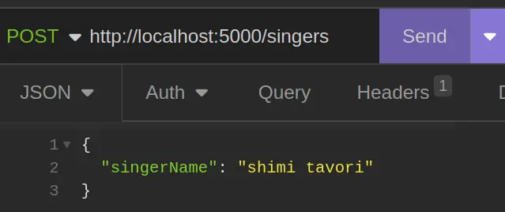

```sh
mkdir nisim
cd nisim
npm init -y
npm install express
```

`index.js`

```javascript
const express = require('express');
const app = express();

app.listen(5000, () => {
	console.log(`server listen to port 5000`);
});
```

# Port in a variable

```javascript
const express = require('express');
const app = express();
const PORT = 5000;

app.listen(PORT, () => {
	console.log(`server listen to port ${PORT}`);
});
```

# Add End Point

two arguments:

* route string
* callback

```javascript
app.get('/nisim', (req, res) => {
	// handler
});
```

# just send status code

```javascript
app.get('/whatever', (req, res) => {
	res.sendStatus(500);
});
```

# Set Response

```javascript
app.get('/king', (req, res) => {
	res.status(200);
	res.send('avi biter');
});
```

# `json` method

```javascript
app.get('/king', (req, res) => {
	res.status(200)
	res.json({
		fname: 'avi',
		lname: 'biter'
	});
});
```

# Chaining

`status` method return the request object

```javascript
app.get('/king', (req, res) => {
	res.status(200).json({
		fname: 'avi',
		lname: 'biter'
	});
});
```

without setting the status it's going to be 200 by default

# `download` method

let's say I have an image `avi.png` in the project directory

```javascript
app.get('/king', (req, res) => {
	res.download('img/avi.png');
});
```

# End Point With A Variable

```
http://localhost:5000/singers/first
http://localhost:5000/singers/second
http://localhost:5000/singers/third
```

# Params

```javascript
const singersMap = new Map([
	['first', 'Elvis Presly'],
	['second', 'Michael Jackson'],
	['third', 'Avi Biter']
]);

app.get('/singers/:nth', (req, res) => {
	const nth = req.params.nth;
	const singerName = singersMap.get(nth);
	res.send(singerName);
});
```

# validation

```javascript
app.get('/singers/:nth', (req, res) => {
	const nth = req.params.nth;
	const singerName = singersMap.get(nth);

	if (!singerName) {
		res.status(404)
			.send('unknown singer key');
		return;
	}

	res.status(200).send(singerName);
});
```

# number parameter

```javascript
const singers = [
	'Elvis Presly',
	'Michael Jackson',
	'Avi Biter'
];

app.get('/singers/:index', (req, res) => {
	const index = parseInt(req.params.index);
	const singerName = singers[index];
	res.status(200).send({ name: singerName });
});
```

# validate

in the handler

```javascript
const index = parseInt(req.params.index);

if (!index && index !== 0) {
	res.status(404).send('not a number');
	return;
}

const singerName = singers[index];

if (!singerName) {
	res.status(404).send('unknown index');
	return;
}

res.status(200).send(singerName);
```

# Post request adding new record

```javascript
app.post('/singers', (req, res) => {
	const singerName = req.body.singerName;
	singers.push(singerName)
	res.status(200).send(`${singerName} added to db`);
});
```

# Problem

```
TypeError: Cannot read properties of undefined
```

# Reason

Express does not parse json in body by default

# Solution

set up middleware that tells Express to parse json before our handler receive the request

```javascript
app.use(express.json());

app.post('/singers', (req, res) => {
	const singerName = req.body.singerName;
	singers.push(singerName)
	res.status(200).send(`${singerName} added to db`);
});
```

# Static Route

create directory called `public`

| index.js
| public
|     pages
|         nisim.html
|         shlomo.html
|         david.html
|     img
|         chad1.png
|         chad2.png
|
|

```javascript
app.use(express.static('public'));
```

```
http://localhost:5000/pages/nisim.html
http://localhost:5000/pages/shlomo.html
http://localhost:5000/pages/david.html
http://localhost:5000/img/chad1.png
http://localhost:5000/img/chad2.png
```

# Client of the server

* browser for get methods
* js (`fetch` function)
* `curl` command
* vscode extension
* insomnia/postman applications

# curl

```bash
curl -X POST http://localhost:5000/singers \
	-H 'Content-Type: application/json' \
	-d '{"singerName":"shimi tavori"}'
```

# REST Client (vscode extension)

```txt
@baseUrl = http://localhost:5000

POST {{baseUrl}}/singers
content-type: application/json

{
    "singerName": "shimi tavori"
}
```


